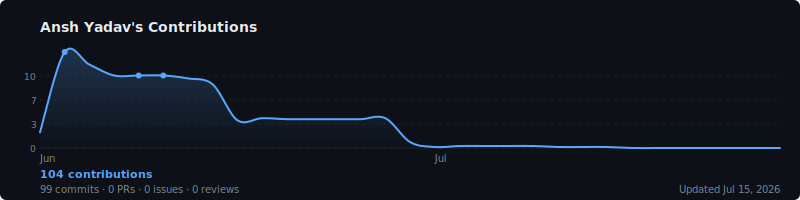
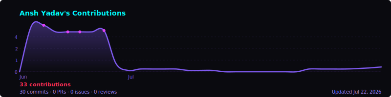

# GitHub Activity Graph — Self-Hosted

A self-hosted GitHub contribution graph that includes **private contributions**, auto-updates daily via GitHub Actions, and outputs an embeddable SVG.

<p align="center">
  <picture>
    <source media="(prefers-color-scheme: dark)" srcset="./output/activity-dark.svg">
    <source media="(prefers-color-scheme: light)" srcset="./output/activity-light.svg">
    
  </picture>
</p>

---

## ✨ Features

| Feature | Details |
|---|---|
| **Private contributions** | Uses GitHub GraphQL API with `read:user` scope — same data as your profile page |
| **Privacy-safe** | Only contribution counts and colors are stored. No repo names, no metadata |
| **Themes** | `dark`, `light`, `cyberpunk`, `high-contrast` |
| **Dark/light switching** | `<picture>` element auto-switches based on viewer's OS theme |
| **Auto-updates** | GitHub Actions workflow runs every day at 01:00 UTC |
| **Stats bar** | Shows total, commits, PRs, issues, reviews, and private count |
| **Tooltips** | Native SVG `<title>` tooltips on every cell |
| **No external services** | 100% self-hosted, open source, free |

---

## 📋 Prerequisites

- A GitHub account
- A repository (can be your `username/username` profile repo, or any public repo)
- Node.js 18+ (only needed for local development)

---

## 🚀 Setup Guide

### Step 1 — Fork or clone this repository

```bash
# Option A: use as a template / fork on GitHub

# Option B: clone and push to a new repo
git clone https://github.com/YOUR_USERNAME/github-activity-graph.git
cd github-activity-graph
```

If you want the graph in your **profile README**, the repo must be named `YOUR_USERNAME/YOUR_USERNAME`.

---

### Step 2 — Create a Personal Access Token

You need a GitHub PAT that can read your contribution data, including private contributions.

1. Go to **GitHub → Settings → Developer settings → Personal access tokens → Tokens (classic)**
   Direct link: https://github.com/settings/tokens

2. Click **Generate new token (classic)**

3. Set the note to something like `activity-graph`

4. Set expiration — choose **No expiration** for a set-and-forget setup, or a date and remember to rotate it

5. Under **Select scopes**, check **only these**:

   | Scope | Why |
   |---|---|
   | `read:user` | Reads your contribution calendar, including private contributions |

   > ⚠️ Do **not** add `repo`, `write:*`, or any other scopes. `read:user` is all that's needed.

6. Click **Generate token** and **copy it immediately** — you won't see it again

---

### Step 3 — Add the token as a GitHub Secret

The token must be stored as a repository secret so the Action can use it securely.

1. Go to your repository on GitHub
2. Click **Settings → Secrets and variables → Actions**
3. Click **New repository secret**
4. Set:
   - **Name:** `GH_PRIVATE_TOKEN`
   - **Value:** paste the token you just created
5. Click **Add secret**

> The token is encrypted by GitHub and never exposed in logs.

---

### Step 4 — (Optional) Set your username as a variable

The workflow automatically uses `github.repository_owner` (the repo owner's username), so this step is only needed if you want to generate a graph for a **different** GitHub user.

1. Go to **Settings → Secrets and variables → Actions → Variables tab**
2. Click **New repository variable**
3. Set:
   - **Name:** `GITHUB_USERNAME`
   - **Value:** your GitHub username
4. Click **Add variable**

---

### Step 5 — Enable GitHub Actions

1. Go to your repository's **Actions** tab
2. If prompted, click **I understand my workflows, go ahead and enable them**
3. Go to **Settings → Actions → General → Workflow permissions**
4. Select **Read and write permissions**
5. Click **Save**

> This is required so the Action can commit the generated SVG back to the repository.

---

### Step 6 — Run the workflow manually (first time)

The workflow runs automatically every day, but you can trigger it immediately:

1. Go to **Actions → Generate Activity Graph**
2. Click **Run workflow** (top right)
3. Choose a theme (or leave as `all` to generate every theme)
4. Click **Run workflow**

After ~30 seconds, a new commit will appear in your repo with the updated SVGs in `output/`.

---

### Step 7 — Add the graph to your README

**Basic (single theme):**
```html
<p align="center">
  
</p>
```

**With automatic dark/light theme switching (recommended):**
```html
<p align="center">
  <picture>
    <source media="(prefers-color-scheme: dark)" srcset="./output/activity-dark.svg">
    <source media="(prefers-color-scheme: light)" srcset="./output/activity-light.svg">
    
  </picture>
</p>
```

**Cyberpunk theme:**
```html
<p align="center">
  
</p>
```

If the graph is in a **different repository** (not your profile repo), use the raw URL:
```html

```

---

## 🎨 Themes

| Name | Description |
|---|---|
| `dark` | GitHub dark mode palette (default) |
| `light` | GitHub light mode palette |
| `cyberpunk` | Neon purple/cyan with animated glow |
| `high-contrast` | GitHub high-contrast accessibility theme |

To generate a specific theme locally:
```bash
THEME=cyberpunk npm run generate
```

To generate all themes:
```bash
npm run generate:all
```

---

## 🛠 Local Development

```bash
# Install dependencies
npm install

# Copy and fill in your credentials
cp .env.example .env
# Edit .env: set GITHUB_USERNAME and GH_PRIVATE_TOKEN

# Generate with default (dark) theme
npm run generate

# Generate all themes
npm run generate:all

# Generate a specific theme
THEME=cyberpunk npm run generate
THEME=light npm run generate
```

`.env.example`:
```
GITHUB_USERNAME=your-github-username
GH_PRIVATE_TOKEN=ghp_xxxxxxxxxxxxxxxxxxxx
THEME=dark
YEARS=1
```

---

## ⚙️ Configuration

All configuration is done via environment variables:

| Variable | Default | Description |
|---|---|---|
| `GITHUB_USERNAME` | repo owner | GitHub username to generate graph for |
| `GH_PRIVATE_TOKEN` | — | PAT with `read:user` scope (required) |
| `THEME` | `dark` | `dark`, `light`, `cyberpunk`, `high-contrast`, or `all` |
| `YEARS` | `1` | Years of contribution history (1–5) |

---

## 🔒 Privacy Model

This tool mirrors **exactly** what GitHub shows on your public profile page:

- The GitHub GraphQL `contributionCalendar` field returns contribution **counts and colors** only
- Private repository names, commit messages, PR titles, and all metadata are **never returned**
- When `restrictedContributionsCount > 0`, it means private contributions are included in the total but remain **completely anonymous**
- The SVG stores only contribution counts, dates, and colors — nothing else

This is the same privacy model GitHub itself uses for the "Include private contributions on my profile" setting.

---

## 🔧 Troubleshooting

### The SVG is empty / no cells filled
- Check that `GH_PRIVATE_TOKEN` is set correctly in repository secrets
- Verify the token has `read:user` scope (not just `repo`)
- Check the Actions log for the exact error message

### Private contributions are not showing
- Go to **GitHub profile → Edit profile → "Include private contributions on my profile"**
- Make sure this setting is **enabled** on your GitHub profile — the API respects this setting

### Workflow fails with "Resource not accessible by integration"
- Go to **Settings → Actions → General → Workflow permissions**
- Change to **Read and write permissions** and save

### Workflow fails with "HTTP 401"
- The token has expired or was revoked
- Create a new token and update the `GH_PRIVATE_TOKEN` secret

### The SVG is not updating in the README
- GitHub caches raw SVG files. Try appending `?v=1` or wait a few minutes
- Make sure the `output/` folder is committed (check `.gitignore`)
- Confirm the workflow ran successfully in the Actions tab

### "User not found" error
- Verify `GITHUB_USERNAME` matches your exact GitHub username (case-sensitive)
- Make sure the token belongs to that user account

### Workflow runs but SVG looks wrong
- Run locally with `DEBUG=1 npm run generate` to see the full stack trace
- Check that Node.js 18+ is installed: `node --version`

---

## 📁 Project Structure

```
.
├── .github/
│   └── workflows/
│       └── generate-activity.yml   # Daily GitHub Actions workflow
├── scripts/
│   ├── fetchContributions.js       # GitHub GraphQL API client
│   ├── generateSvg.js              # SVG renderer (all themes)
│   ├── generateAllThemes.js        # Batch generator for all themes
│   └── index.js                    # Entry point
├── output/
│   ├── activity.svg                # Default (dark) graph — auto-generated
│   ├── activity-dark.svg           # Dark theme
│   ├── activity-light.svg          # Light theme
│   ├── activity-cyberpunk.svg      # Cyberpunk / neon theme
│   └── activity-high-contrast.svg  # High-contrast theme
├── package.json
└── README.md
```

---

## 🙏 License

MIT — free to use, modify, and self-host.
