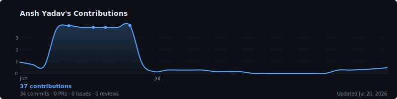

cat > /mnt/user-data/outputs/README.md << 'EOFILE'
<div align="center">


<br/>

[](https://nodejs.org)
[](https://github.com/features/actions)
[](https://docs.github.com/en/graphql)
[](LICENSE)
[](https://github.com)

<br/>

<picture>
  <source media="(prefers-color-scheme: dark)" srcset="https://raw.githubusercontent.com/AlooDaParatha/Github-Activities/main/output/activity-dark.svg?v=2">
  <source media="(prefers-color-scheme: light)" srcset="https://raw.githubusercontent.com/AlooDaParatha/Github-Activities/main/output/activity-light.svg?v=2">
  
</picture>

<sub>☝️ Live graph — regenerated every day at 01:00 UTC by GitHub Actions</sub>

<br/><br/>

</div>

---

## What is this?

**Activity Graph** is a fully self-hosted GitHub contribution graph that you own completely. It fetches your real contribution data — including private contributions — directly from the GitHub GraphQL API, renders a smooth animated line graph as an SVG, and commits it back to your repository automatically every day.

No third-party servers. No rate limits. No outages. No vendor lock-in. Just a clean SVG on GitHub's own CDN.

---

## Features

<table>
<tr>
<td width="50%">

**📈 Smooth Line Graph**
Catmull-Rom curved line with gradient area fill underneath. 7-day rolling average for a clean, readable shape. Peak dots automatically appear on your highest activity days.

**🔒 Private Contributions Included**
Uses the `contributionsCollection` GraphQL field — exactly what GitHub's own profile page uses. Private commit counts are included but fully anonymized. No repo names, no metadata, ever.

**🎨 4 Themes**
`dark` · `light` · `cyberpunk` · `high-contrast`
Auto-switches between dark and light based on the viewer's system theme using the `<picture>` element.

</td>
<td width="50%">

**⚡ Zero Infrastructure**
Runs entirely on GitHub Actions. No server, no database, no container, no external API keys beyond your own GitHub token. The output is a static SVG served by GitHub's CDN.

**📅 Configurable Date Range**
Show the last 30 days, 90 days, or up to 5 years. Set via the `DAYS` environment variable — no code changes needed.

**🔁 Fully Automatic**
Cron job runs at 01:00 UTC every day. Also triggers on pushes to `main` and can be run manually anytime from the Actions tab.

</td>
</tr>
</table>

---

## Themes

<table>
<tr>
<th align="center">🌙 dark</th>
<th align="center">☀️ light</th>
</tr>
<tr>
<td></td>
<td></td>
</tr>
<tr>
<th align="center">⚡ cyberpunk</th>
<th align="center">🔳 high-contrast</th>
</tr>
<tr>
<td></td>
<td></td>
</tr>
</table>

---

## Project Structure

```
Github-Activities/
├── .github/
│   └── workflows/
│       └── generate-activity.yml   ← Daily cron + manual trigger
├── scripts/
│   ├── fetchContributions.js       ← GitHub GraphQL API (private contribs included)
│   ├── generateSvg.js              ← Line graph SVG renderer, all 4 themes
│   ├── generateAllThemes.js        ← Generates every theme in one run
│   └── index.js                    ← Entry point
├── output/
│   ├── activity.svg                ← Default (dark) — auto-committed daily
│   ├── activity-dark.svg
│   ├── activity-light.svg
│   ├── activity-cyberpunk.svg
│   ├── activity-high-contrast.svg
│   └── picture-snippet.html        ← Ready-to-paste embed code
├── .env.example
├── package.json
└── README.md
```

---

## Setup Guide

### Step 1 — Fork or clone

```bash
git clone https://github.com/AlooDaParatha/Github-Activities.git
cd Github-Activities
npm install
```

---

### Step 2 — Create a Personal Access Token

Go to **[github.com/settings/tokens](https://github.com/settings/tokens)** → **Generate new token (classic)**

Check these scopes:

| Scope | Why |
|---|---|
| `repo` | Needed to push the generated SVG back to your repository |
| `read:user` | Reads your contribution calendar including private contributions |

Set expiration to **No expiration** for set-and-forget. Click **Generate token** and copy it immediately.

> ⚠️ Never paste your token anywhere except the GitHub Secrets field. Not in code, not in chat, not in commits.

---

### Step 3 — Add as a GitHub Secret

Repo → **Settings → Secrets and variables → Actions → New repository secret**

```
Name:  GH_PRIVATE_TOKEN
Value: ghp_xxxxxxxxxxxxxxxxxxxx
```

---

### Step 4 — Set workflow permissions

Repo → **Settings → Actions → General → Workflow permissions**

Select **Read and write permissions** → Save

This allows the Action to commit and push the generated SVG back to your repo.

---

### Step 5 — Run the workflow

**Actions → Generate Activity Graph → Run workflow → Run workflow**

After ~30 seconds a new commit will appear in your repo with all SVG files in `output/`.

---

### Step 6 — Embed in any README

**Auto dark/light switching (recommended):**

```html
<p align="center">
  <picture>
    <source media="(prefers-color-scheme: dark)" srcset="https://raw.githubusercontent.com/AlooDaParatha/Github-Activities/main/output/activity-dark.svg?v=2">
    <source media="(prefers-color-scheme: light)" srcset="https://raw.githubusercontent.com/AlooDaParatha/Github-Activities/main/output/activity-light.svg?v=2">
    
  </picture>
</p>
```

**Single theme:**
```html

```

**Same repo (relative path):**
```html

```

> 💡 Bump `?v=2` to `?v=3` anytime you want to force GitHub's cache to refresh.

---

## Configuration

All options are set via environment variables — no code changes needed.

| Variable | Default | Description |
|---|---|---|
| `GITHUB_USERNAME` | repo owner | GitHub username to generate graph for |
| `GH_PRIVATE_TOKEN` | — | Classic PAT with `repo` + `read:user` scopes |
| `THEME` | `dark` | `dark` · `light` · `cyberpunk` · `high-contrast` · `all` |
| `DAYS` | `30` | Days of history to show (e.g. 30, 90, 365) |

Set these in the workflow file or in your local `.env` for development.

---

## Local Development

```bash
# Clone and install
git clone https://github.com/AlooDaParatha/Github-Activities.git
cd Github-Activities
npm install

# Set up credentials
cp .env.example .env
# Edit .env with your GITHUB_USERNAME and GH_PRIVATE_TOKEN

# Generate with default theme (dark, last 30 days)
npm run generate

# Generate all 4 themes at once
npm run generate:all

# Specific theme
THEME=cyberpunk npm run generate
THEME=light     npm run generate

# Custom date range
DAYS=90  npm run generate
DAYS=365 npm run generate
```

---

## Changing the Date Range

To show a different time window, edit `scripts/fetchContributions.js`:

**Last 30 days (default):**
```js
const DAYS = parseInt(process.env.DAYS || "30", 10);
const from = new Date(now.getTime() - DAYS * 24 * 60 * 60 * 1000).toISOString();
```

**Or set it in the workflow without touching code:**
```yaml
env:
  DAYS: "90"
```

---

## Troubleshooting

**Graph not updating in README**
GitHub caches images hard. Bump the `?v=` number in your embed URL (`?v=2` → `?v=3`) and hard refresh with `Ctrl+Shift+R`.

**Workflow fails: exit code 128 / permission denied**
Go to Settings → Actions → General → Workflow permissions → set to **Read and write**.

**Workflow fails: HTTP 401 or 403**
Your token expired or was revoked. Generate a new one at `github.com/settings/tokens` and update the `GH_PRIVATE_TOKEN` secret.

**Private contributions not showing**
Enable **"Include private contributions on my profile"** in your [GitHub profile settings](https://github.com/settings/profile). The API respects this toggle.

**"User not found" error**
`GITHUB_USERNAME` must match your exact GitHub handle — it is case-sensitive.

**Workflow stopped running automatically**
GitHub disables scheduled workflows after 60 days of repo inactivity. Re-enable from the Actions tab when prompted.

**SVG looks correct on raw URL but README shows old version**
This is purely a cache issue. Add or bump `?v=N` to the srcset URLs in your README.

---

## Privacy Model

| What's fetched | What's stored in SVG |
|---|---|
| Contribution counts per day | ✅ Yes — counts and dates only |
| Contribution colors | ✅ Yes — anonymous intensity levels |
| Private repo names | ❌ Never — structurally absent from API response |
| Commit messages | ❌ Never |
| PR or issue titles | ❌ Never |
| Any private metadata | ❌ Never |

The GitHub GraphQL `contributionCalendar` field returns the same anonymized data that appears on your public profile. Private contributions are counted but never identified.

---

## How It Works

```
Every day at 01:00 UTC
         │
         ▼
  GitHub Actions triggers
         │
         ▼
  fetchContributions.js
  └─ GraphQL query to api.github.com
  └─ Returns counts + colors (no private metadata)
         │
         ▼
  generateSvg.js
  └─ 7-day rolling average
  └─ Catmull-Rom smooth curve
  └─ Gradient area fill
  └─ Peak dots on high days
  └─ Month labels + stats bar
  └─ Renders all 4 theme SVGs
         │
         ▼
  git commit + push → output/
         │
         ▼
  README updates via raw.githubusercontent.com CDN
```

---

<div align="center">

**MIT License · No external services · Built on the GitHub GraphQL API**

<br/>


</div>
